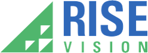

<!-- PROJECT LOGO -->
 

  

  <h3 align="center">Rise Vision Test - Osman Karame</h3>

  

    Hi everyone, Here is the take home project. Firstly I would like to thank you for giving me this opportunity, it was a really fun process from the start. It was a good experience and hopefully I will have the occasion to create more with you.. I'm happy to share with you the little project which I had fun to do. Minor thing to add, I didn't know when I started that K-12 school start from kindergarden. I would propably have designed something more fun and joyful than what it is but I believe that it stills gives you an idea of what I can do. Have a nice day and thank you again.
     
    <a href="https://github.com/oskarame/Rise-Vision-Test/index.html">View Demo</a>
  

<!-- TABLE OF CONTENTS -->
## Table of Contents

* [About the Project](#about-the-project)
  * [Built With](#built-with)
* [Contact](#contact)
* [Acknowledgements](#acknowledgements)

<!-- ABOUT THE PROJECT -->
## About The Project

### Built With

* [Bootstrap]()

## Contact

Osman Karme - osmankarame@gmail.com

Project Link: [https://github.com/oskarame/Rise-Vision-Test](https://github.com/oskarame/Rise-Vision-Test)

## Acknowledgements

* [Animate.css](https://daneden.github.io/animate.css)

[linkedin-url]: https://linkedin.com/in/oskarame
[product-screenshot]: images/screenshot.jpg
